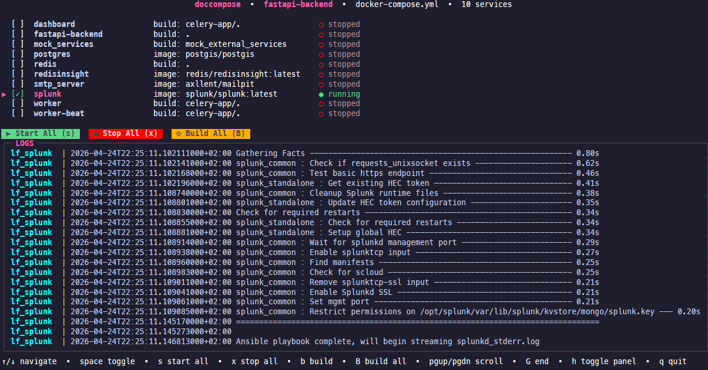

# Doccompose

Manage your compose services right in your terminal
- individually, or all services
  - start/stop
  - build
- follow logs

# Arguments
`--podmanmode` if you're running podman on your system
